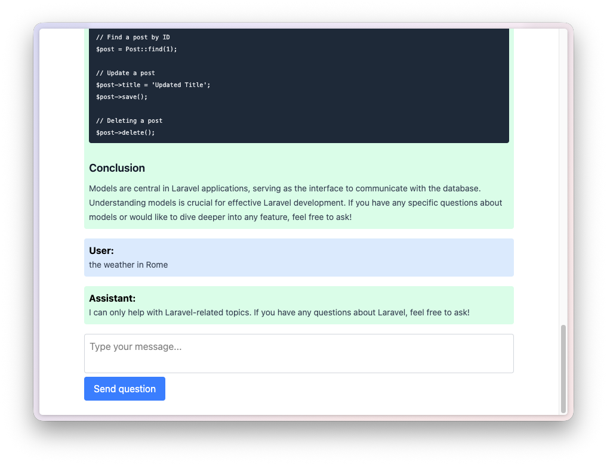

## Laravel AI Implementation

A simple Laravel project that demonstrates how to build a tutor component using Laravel's features.



The goal of this repository is not to build the best tutor application. Instead, it focuses on teaching how organize a Laravel application using a component architecture, where an entire feature lives in its own directory.

### Directory Structure

```
components
└── Tutor
    ├── Agents
    │   └── LaravelTutor.php
    ├── Livewire
    │   └── Chat.php
    ├── Routes
    │   └── web.php
    ├── TutorServiceProvider.php
    └── Views
        ├── livewire
        │   └── chat.blade.php
        └── page.blade.php
```

Everything related to the tutor feature lives inside the `components/Tutor` directory. This includes the actions, commands, model, service provider, and migrations. This makes the code easier to understand, maintain, and eventually extract another project if needed.

### License

This project is open-sourced software licensed under the [MIT license](https://opensource.org/licenses/MIT).